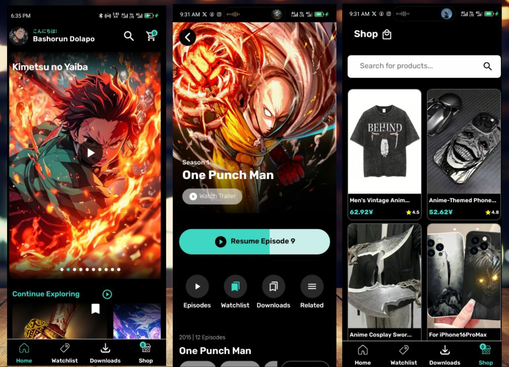

# Animax - Your Ultimate Anime Hub

## Overview

Animax is a mobile application built with React Native, TypeScript, Redux, Appwrite, and Expo. It's designed for anime enthusiasts to discover, watch trailers of, bookmark their favorite shows, and even purchase anime-themed merchandise. This project was developed over a month, focusing on creating a seamless and engaging experience for anime fans.

## Screenshots

Here's a glimpse of Animax in action:

 


## Key Features

* **User Authentication:** Secure sign-in using Google Authentication provided by Appwrite. The sign-in screen features a visually appealing slider animation.
* **Homepage with Featured Anime:** Discover new and popular anime through a featured slider on the homepage. Clicking on a featured anime leads to a page where you can watch its trailer.
* **Watchlist:** Keep track of the anime you're interested in by adding them to your watchlist. From the watchlist, you can view details such as description, genre(s), and the number of episodes. You also have the option to remove anime from your watchlist and watch trailers.
* **Integrated Shop:** Browse and purchase a variety of anime-themed merchandise. The shop section allows you to view product details and add items to your cart.
* **Payment Workflow:** A streamlined payment process with a delightful Lottie animation that appears after clicking the pay button. An informative animation is also displayed when the cart is empty.
* **Custom Backend API:** The app utilizes a basic API system built from scratch to manage data.

## Technologies Used

* **React Native:** A JavaScript framework for building native mobile apps.
* **TypeScript:** A statically typed superset of JavaScript that enhances code maintainability and reduces errors.
* **Redux:** A predictable state management library for JavaScript applications.
* **Appwrite:** An open-source backend-as-a-service platform used for authentication (Google Sign-In).
* **Expo:** A framework and platform for universal React applications, simplifying the development, building, and deployment process.
* **Lottie:** A library for rendering After Effects animations in real-time, used for the payment success and empty cart animations.
* **React Native's `Animated` API:** Used in conjunction with Lottie for creating smooth animations.

## Installation and Setup (For Developers)

This project was built using Expo. To run it locally, ensure you have Node.js and npm (or yarn) installed on your system.

1.  **Clone the repository:**
    ```bash
    git clone <repository_url>
    cd Animax
    ```

2.  **Install dependencies:**
    ```bash
    npm install
    # or
    yarn install
    ```

3.  **Set up Appwrite:**
    * Create an account on [Appwrite](https://appwrite.io/).
    * Create a new project.
    * Set up Google Authentication as a provider in your Appwrite project.
    * Obtain your Appwrite project ID and API endpoint.
    * Configure the necessary Appwrite credentials in your Animax app (you might need to create a `.env` file or similar for environment variables).

4.  **Start the Expo development server:**
    ```bash
    npx expo start
    # or
    yarn start
    ```

    This will open the Expo Developer Tools in your browser, where you can run the app on a simulator/emulator or a physical device using the Expo Go app.

## Usage (For Users)

1.  **Sign In:** Upon opening the app, you will be prompted to sign in using your Google account.
2.  **Homepage:** Explore the "Featured Anime" slider to discover new trailers. Tap on a featured anime to view its trailer on a dedicated page.
3.  **Watchlist:** Navigate to the watchlist section to see the anime you have bookmarked. Tap on an anime in the watchlist to view its details (description, genres, episode count) and watch the trailer again. You can also remove anime from your watchlist here.
4.  **Shop:** Browse the "Shop" section to view available anime-themed merchandise. Tap on an item to see its details and add it to your cart.
5.  **Checkout:** Proceed to the cart to review your selected items and initiate the payment process. Enjoy the animated feedback upon successful payment or when your cart is empty.

## Future Improvements

The developer has outlined several potential improvements for Animax in the future, including:

* **Robust Streaming Capabilities:** Implementing full episode streaming within the app.
* **Enhanced Playback Controls:** Adding features like adjustable speed, subtitles, and resolution options to the video player.
* **AI-Powered Recommendations:** Integrating AI to provide more personalized anime recommendations based on viewing history.
* **Offline Viewing:** Allowing users to download anime for offline playback.
* **Community Forum:** Creating a dedicated forum within the app for anime enthusiasts to discuss their favorite shows.
* **Anime Download Feature:** Enhancing the download functionality for offline access.

## Author

This project was developed by Bashorun Dolapo (yours truly), a passionate anime fan who dedicated their free time to bring Animax to life.

## Acknowledgements

* **React Native, TypeScript, Redux, Expo:** For providing the powerful tools and frameworks to build this cross-platform application efficiently.
* **Appwrite:** For the seamless Google Authentication and backend services.
* **Lottie:** For the beautiful and engaging animations.
* The anime community for their inspiration and enthusiasm.

## Stay Awesome!

Keep building and stay awesome!